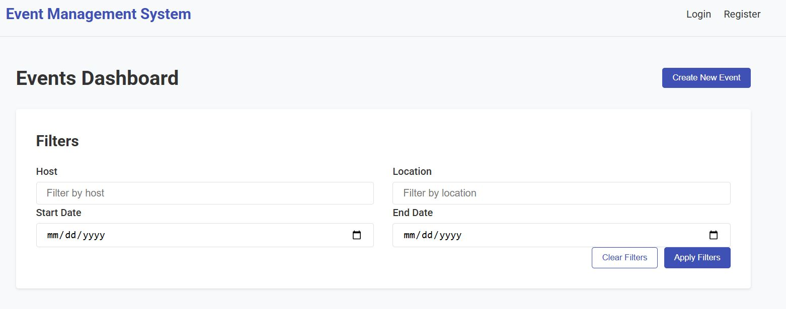
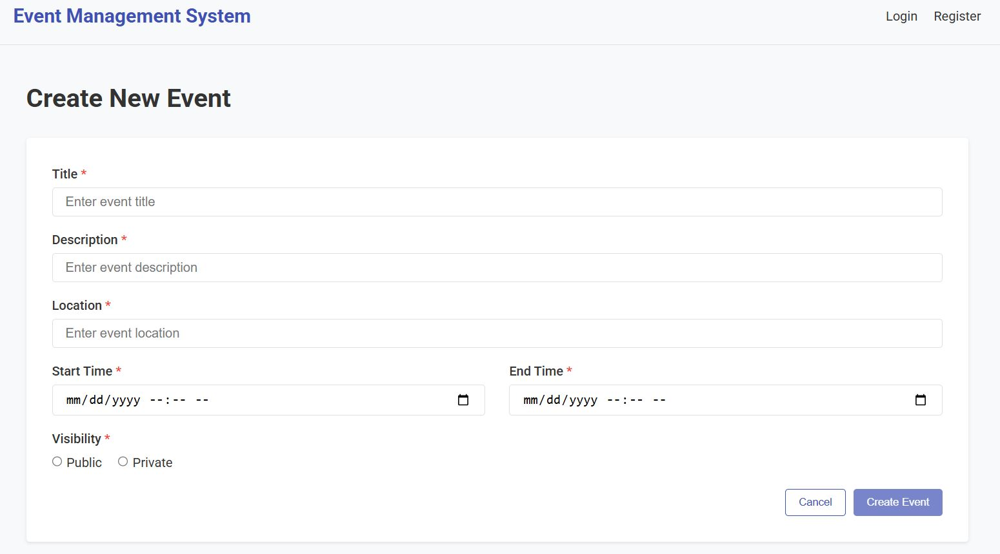
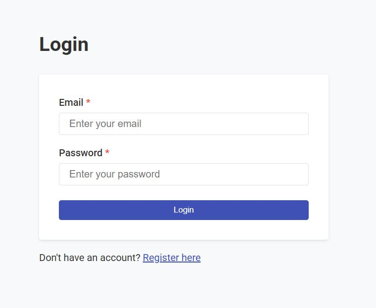
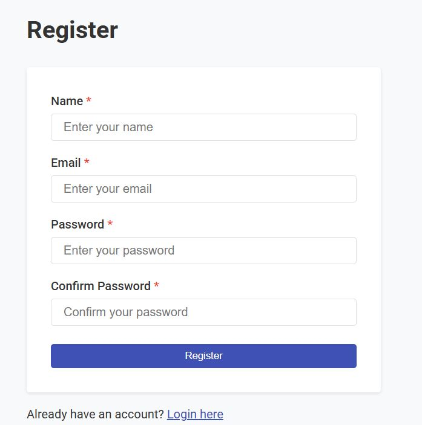

## Event Management System 2.0

### Components

- **Frontend**: React.js with Vite
- **Backend**: Spring Boot 3.x REST API with JWT Authentication
- **Database**: PostgreSQL 15

### Features

- User authentication and authorization with JWT
- Event creation, management, and discovery
- Event attendance tracking
- Responsive UI for mobile and desktop
- Role-based access control (User, Admin)

### Requirements

- Docker
- Docker Compose

### Running the Application

1. Clone the repository:
   ```bash
   git clone https://github.com/nimeshaviduranga/Event_Management_System_2.0.git
   cd Event_Management_System_2.0

2. Start all services using Docker Compose:
   ```bash
      docker-compose up -d

3. Access the application:

Frontend: http://localhost

Backend API: http://localhost:8080/api

Database: localhost:5432 

4. To stop the application:
   ```bash
      docker-compose down

5. To remove all data volumes as well:
   ```bash
      docker-compose down -v   

### Screenshots




